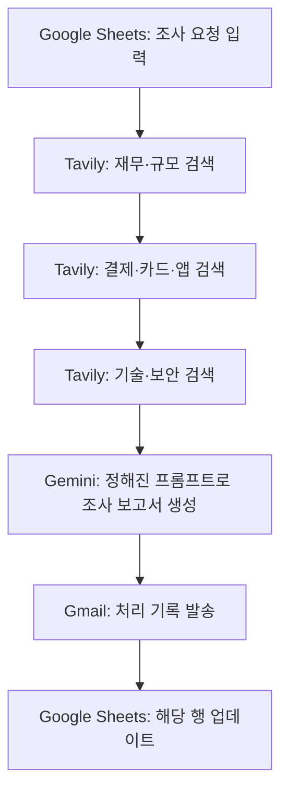

# 해외 은행 리서치 자동화

> 반복적인 시장 조사를 자동화해, 제안 담당자가 정보 수집보다 은행별 사업 방향과 제안 전략을 검토하는 데 더 많은 시간을 쓰도록 만든 업무 도구입니다.

## 프로젝트 요약

| 항목 | 내용 |
|---|---|
| 해결하려 한 문제 | 해외 은행 제안 준비 때마다 은행 규모, 경영진, 결제·카드 사업, 보안 기술 관심도 등을 반복 조사 |
| 내가 맡은 일 | 공통 조사 항목과 결과 형식 정의, Zapier 흐름 구성, Gemini 프롬프트 작성·수정, 출처 및 정성 평가 검토 |
| 사용 도구 | Zapier, Tavily, Gemini, Google Sheets, Gmail |
| 적용 범위 | 반복 은행 조사 20건 |
| 확인한 변화 | 건당 조사 시간을 약 30분에서 약 5분으로 단축. 확보한 시간을 은행별 제안 전략 검토에 활용 |
| 공개 범위 | 자동화 흐름과 민감정보를 제거한 프롬프트 설명 공개. 원본 결과와 회사 자료는 미공개 |

## 배경과 목표

해외 은행 미팅을 준비하려면 여러 출처를 찾아 은행의 규모와 사업 정보, 관련 기술 관심도를 조사해야 했습니다. 반복할 때마다 비슷한 항목을 새로 찾아 정리하느라, 조사 결과를 해석하고 은행별 제안 방향을 고민할 시간이 줄었습니다.

조사에 필요한 공통 항목과 출력 형식을 먼저 정하고, 검색과 요약을 자동화해 조사 준비 시간을 줄이는 것을 목표로 삼았습니다. 자동 생성 결과를 그대로 보고서에 쓰기보다, 출처를 확인하고 해석이 필요한 정보는 사람이 검토하도록 구성했습니다.

## 자동화 흐름

마지막 단계는 Google Sheets 행 업데이트입니다. Gmail 발송은 자동화 처리 기록을 남기기 위한 단계입니다.

### 단계별 역할

1. Google Sheets 입력: 새 조사 요청 또는 수정된 요청을 감지합니다.
2. Tavily 검색 3회: 재무·규모, 결제·카드·앱, 기술·보안 정보를 나눠 검색합니다.
3. Gemini 보고서 생성: 검색 결과를 정해둔 항목과 형식에 맞춰 요약합니다.
4. Gmail 기록 발송: 처리된 내용에 대한 기록을 남깁니다.
5. Google Sheets 업데이트: 자동화 결과를 해당 조사 행에 반영해 흐름을 마칩니다.

## Gemini 프롬프트 설계

프롬프트에 은행명과 세 가지 검색 결과를 입력값으로 연결하고, 보고서의 항목·문체·출처 표기·FDS 설명 기준을 지정했습니다. 아래는 실제 업무 프롬프트에서 은행명과 검색 결과를 변수로 치환해 옮긴 예시입니다.

사용한 프롬프트 보기

<pre>
너는 글로벌 금융 리서치 기관의 수석 분석가야. 아래 제공된 3가지 검색 결과를 바탕으로 {{은행명}}에 대한 심층 보고서를 작성해줘.

[제공된 데이터]

재무/규모 정보: {{재무/규모 정보}}

결제/카드/앱 정보: {{결제/카드/앱 정보}}

기술/보안 정보: {{기술/보안 정보}}

[작성 지침]

모든 문장은 "~함", "~임", "~증가", "~감소"와 같이 명사형 또는 간결한 개조식으로 끝낼 것. 문장형 종결은 사용하지 말 것.

불필요한 미사여구와 연결어를 배제하고 수치와 팩트 위주로 작성할 것.

모든 수치는 데이터에 근거하고 출처의 연도나 보고서명을 명시할 것.

카드 결제액이나 앱 MAU가 검색 결과에 없을 경우 성장률이나 점유율로 추정해 설명할 것. 근거가 없으면 공식 미발표로 명시할 것.

사기 탐지 기술(FDS)은 수치보다 기술 명칭, 작동 방식, 파트너십 기업명을 구체적으로 설명할 것.

보고서에는 ### 또는 ** 같은 마크다운 기호를 사용하지 말 것.

소제목은 [1. 은행 규모] 형태로 작성하고, 불렛은 * 또는 - 기호만 사용할 것.

[보고서 형식]

[1. 은행 규모] 자산, 순이익, 지점 수

[2. 카드 및 결제 현황] 카드 수, 결제액, 디지털 이용자

[3. 핵심 기술] FDS, AI 보안, 파트너십 현황

[4. 종합 인사이트] 분석가 소견 5개
</pre>

## 설계에서 고려한 점

### 조사 기준과 결과 형식 표준화

은행별로 같은 정보를 비교할 수 있도록 공통 조사 항목과 시트 구조를 먼저 정리했습니다. 프롬프트와 표 구조를 조정해 결과를 은행별로 비교하기 쉽도록 했습니다.

### 검색 근거 확인

요약과 함께 출처 링크가 남도록 구성했습니다. 각 정보가 실제 출처에서 확인되는지 원문을 대조해 검토했습니다.

### 정성 정보는 사람이 다시 판단

보안 기술에 대한 관심처럼 검색 결과만으로 단정하기 어려운 항목은 판단 근거와 점수를 함께 확인하고, 결과를 직접 검토했습니다. 점수를 확정적인 사실처럼 다루지 않도록 사람의 확인 단계를 두었습니다.

### 프롬프트에서 확인한 개선 과제

원래 프롬프트는 카드 결제액이나 앱 MAU가 검색 결과에 없을 때, 성장률·점유율을 바탕으로 추정치를 제시하도록 했습니다. 추정은 사업 규모를 가늠하는 초안으로 활용하고, 출처와 계산 근거를 사람이 다시 확인하는 방식입니다. 추정 근거가 충분하지 않으면 공식 미발표로 남기고, 공개 보고서에서는 추정치임을 명시하도록 설계할 수 있습니다.

## 결과와 활용

반복 은행 조사 20건에 적용했습니다. 조사 요청을 Google Sheets에 입력한 시점부터 조사 결과를 해당 행에 업데이트할 때까지 걸리는 시간이 건당 약 30분에서 약 5분으로 줄었습니다. 출처와 정성 정보는 사람이 확인했고, 확보한 시간은 은행별 사업 방향과 보안 수요에 맞춘 제안 전략 검토에 활용했습니다.

## 내 기여

- 반복 조사에서 공통으로 필요한 정보와 결과 형식을 정리했습니다.
- Zapier에서 Sheets 입력, Tavily 검색 3회, Gemini 요약, Gmail 기록 발송, Sheets 행 업데이트를 연결했습니다.
- Gemini 프롬프트와 시트 구조를 은행별 비교에 맞게 조정했습니다.
- 출처 링크를 원문과 대조하고, 정성 항목의 근거와 점수를 사람이 확인했습니다.
- 자동화로 확보한 시간을 제안 전략을 검토하는 데 활용했습니다.

## 공개 범위

프로젝트 설명, 자동화 흐름, 민감정보를 제거한 프롬프트 구성만 공개합니다. 은행별 검색 결과, Google Sheets 원본, 보고서, Gmail 기록은 회사 업무 자료이므로 공개 대상에서 제외합니다.

## 한계와 다음 개선

- 검색 결과와 AI 요약은 누락되거나 잘못 해석될 수 있어 원문 확인이 필요합니다.
- 보안 기술 관심도처럼 정성적인 판단은 검색 자동화만으로 확정할 수 없습니다.
- 현재 기록은 조사 시간을 중심으로 한 결과입니다. 결과 정확도와 재사용 빈도는 별도 지표로 측정하지 않았습니다.
